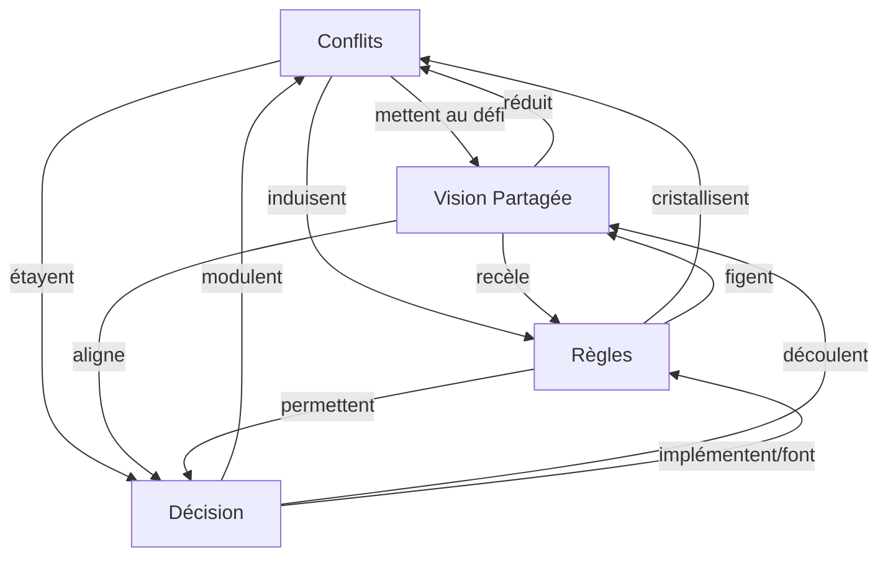

# Relations entre les thèmes

```mermaid
graph TD
 Conflits
 Vision[Vision Partagée]
 Règles
 Décision

 Conflits -- mettent au défi --> Vision
 Conflits -- induisent --> Règles
 Conflits -- étayent --> Décision

 Vision -- réduit --> Conflits
 Vision -- recèle --> Règles
 Vision -- aligne --> Décision

 Règles -- cristallisent --> Conflits
 Règles -- permettent --> Décision
 Règles -- figent --> Vision

 Décision -- modulent --> Conflits
 Décision -- découlent --> Vision
 Décision -- implémentent/font --> Règles
```
