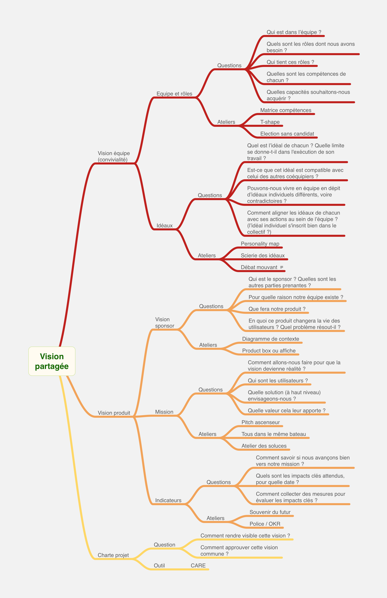

# Vision partagée, facilitation à Discngine

Les outils de facilitation pour une vision partagée.

## Qu'est ce que la vision ?

En général, la vision répond à la question Pourquoi ?
L'usage le plus courant est celui qui porte sur le produit (on parle de Product Vision).

La vision (produit) exprime le futur désiré des utilisateurs du produit ou service.

On peut aussi étendre la vision à l'équipe, celle en charge du produit à faire. La question du Pourquoi (pourquoi existons-nous en tant qu'équipe ?) permet de forger un esprit d’équipe préalablement à son travail sur le produit.

## Ebauche de périmètre

Pour chaque composant de la vision (produit et équipe) nous donnons une liste de questions auxquelles la facilitation peut aider à répondre et les ateliers possibles.

### Vision équipe   
  Cette partie cherche à développer la convivance (le vivre ensemble).

#### Equipe et rôles

- Questions
	- Qui est dans l’équipe ?
	- Quels sont les rôles dont nous avons besoin ?
	- Qui tient ces rôles ?
	- Quelles sont les compétences de chacun ?
	- Quelles capacités souhaitons-nous acquérir ?

- Ateliers
	- Matrice compétences
	- T-shape
	- Election sans candidat

#### Idéaux

- Questions
	- Quel est l’idéal de chacun ? Quelle limite se donne-t-il dans l'exécution de son travail ?
	- Est-ce que cet idéal est compatible avec celui des autres coéquipiers ?
	- Pouvons-nous vivre en équipe en dépit d’idéaux individuels différents, voire contradictoires ?
	- Comment aligner les idéaux de chacun avec ses actions au sein de l’équipe ? (l’idéal individuel s'inscrit bien dans le collectif ?)

- Ateliers
	- Personality map
	- Scierie des idéaux
	- Débat mouvant
		https://www.multibao.org/#multibao/contributions/blob/master/contributions/debat_mouvant.md

### Vision produit

La vision (produit) est d'abord exprimée par le sponsor ou commanditaire. Elle peut être reformulée collectivement, puis l'équipe y répond en déclinant sa mission. Pour s'assurer que la mission est sur les bons rails, des indicateurs sont utiles.

#### Vision (sponsor)

Le sponsor est la personne qui décide d’accorder le budget, d’affecter des personnes et de donner des moyens à l’équipe. Il donne sa vision du produit ou service à développer par l’équipe. Il est généralement celui qui reçoit les revenus tirés des résultats de l’équipe.

    - Questions
    	- Qui est le sponsor ? Quelles sont les autres parties prenantes ?
    	- Pour quelle raison notre équipe existe ?
    	- Que fera notre produit ?
    	- En quoi ce produit changera la vie des utilisateurs ? Quel problème résout-il ?

    - Ateliers
    	- Diagramme de contexte
    	- Product box ou affiche

#### Mission

La mission, c’est ce que se propose de faire l’équipe pour atteindre la vision. La vision clarifie le pourquoi, la mission expose, sans les détails, ce que l’équipe propose pour cheminer vers la vision. Elle donne juste ce qu’il faut d’information pour permettre à l’équipe de se focaliser sur un horizon à moyen ou long terme.

    - Questions
    	- Comment allons-nous faire pour que la vision devienne réalité ?
    	- Qui sont les utilisateurs ?
    	- Quelle solution (à haut niveau) envisageons-nous ?
    	- Quelle valeur cela leur apporte ?

    - Ateliers
    	- Pitch ascenseur
    	- Tous dans le même bateau
    	- Atelier des soluces

#### Indicateurs

La vision et la mission sont des notions qui fixent un cap. Pour savoir si l'équipe suivra la bonne direction, elle se donne des impacts clés quantitatifs qui permettront d'évaluer le chemin parcouru.

    - Questions
    	- Comment savoir si nous avançons bien vers notre mission ?
    	- Quels sont les impacts clés attendus, pour quelle date ?
    	- Comment collecter des mesures pour évaluer les impacts clés ?

    - Ateliers
    	- Souvenir du futur
    	- Police / OKR

## Charte projet

L’équipe résume, dans un document très court, idéalement susceptible d’être affiché aux murs de l’espace de travail ou dans un espace sur Miro, la vision, le périmètre et les accords réciproques passés avec le sponsor et les parties prenantes.
Cela constitue la charte du projet.

- Questions
    - Comment rendre visible cette vision ?
    - Comment approuver cette vision commune ?

- Outil
    - [La charte projet avec CARE](https://www.aubryconseil.com/post/2022/canevas/)
